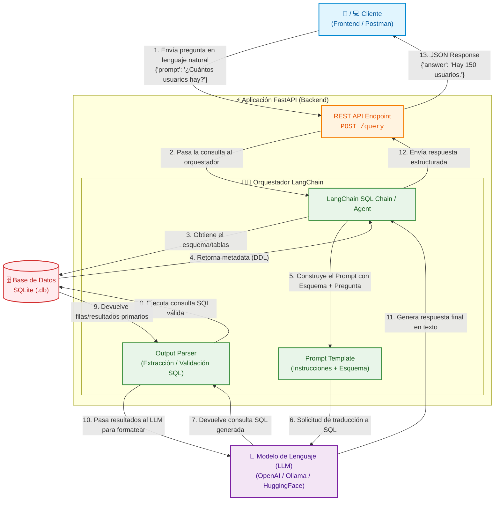

# text-to-sql

Convert a input text to SQL sentence using SQLite as database.

Application with LangGraph:

Arrchitecture:

```mermaid
graph TD
    %% Estilos de colores
    classDef client fill:#e1f5fe,stroke:#0288d1,stroke-width:2px,color:#01579b;
    classDef api fill:#fff3e0,stroke:#f57c00,stroke-width:2px,color:#e65100;
    classDef langchain fill:#e8f5e9,stroke:#388e3c,stroke-width:2px,color:#1b5e20;
    classDef llm fill:#f3e5f5,stroke:#7b1fa2,stroke-width:2px,color:#4a148c;
    classDef db fill:#ffebee,stroke:#d32f2f,stroke-width:2px,color:#b71c1c;

    %% Nodos
    Client["📱 / 💻 Cliente<br>(Frontend / Postman)"]:::client

    subgraph FastAPI_App["⚡ Aplicación FastAPI (Backend)"]
        API_Endpoint["REST API Endpoint<br><code>POST /query</code>"]:::api

        subgraph LangChain_Engine["🦜🔗 Orquestador LangChain"]
            SQL_Agent["LangChain SQL Chain / Agent"]:::langchain
            Prompt_Template["Prompt Template<br>(Instrucciones + Esquema)"]:::langchain
            SQL_Parser["Output Parser<br>(Extracción / Validación SQL)"]:::langchain
        end
    end

    LLM["🧠 Modelo de Lenguaje (LLM)<br>(OpenAI / Ollama / HuggingFace)"]:::llm
    SQLite_DB[("🗄️ Base de Datos<br>SQLite (.db)")]:::db

    %% Flujos de interacción
    Client -->|"1. Envía pregunta en lenguaje natural<br>{'prompt': '¿Cuántos usuarios hay?'}"| API_Endpoint
    API_Endpoint -->|"2. Pasa la consulta al orquestador"| SQL_Agent
    
    SQL_Agent -->|"3. Obtiene el esquema/tablas"| SQLite_DB
    SQLite_DB -->|"4. Retorna metadata (DDL)"| SQL_Agent

    SQL_Agent -->|"5. Construye el Prompt con Esquema + Pregunta"| Prompt_Template
    Prompt_Template -->|"6. Solicitud de traducción a SQL"| LLM
    LLM -->|"7. Devuelve consulta SQL generada"| SQL_Parser

    SQL_Parser -->|"8. Ejecuta consulta SQL válida"| SQLite_DB
    SQLite_DB -->|"9. Devuelve filas/resultados primarios"| SQL_Parser

    SQL_Parser -->|"10. Pasa resultados al LLM para formatear"| LLM
    LLM -->|"11. Genera respuesta final en texto"| SQL_Agent

    SQL_Agent -->|"12. Envía respuesta estructurada"| API_Endpoint
    API_Endpoint -->|"13. JSON Response<br>{'answer': 'Hay 150 usuarios.'}"| Client
```
